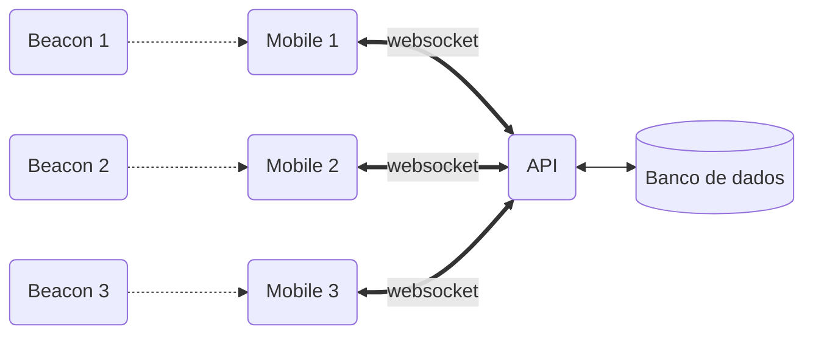
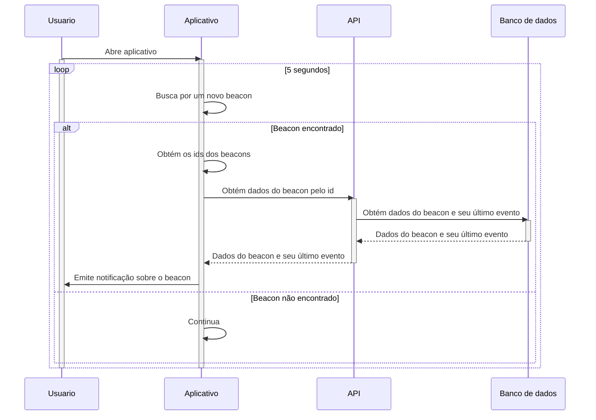
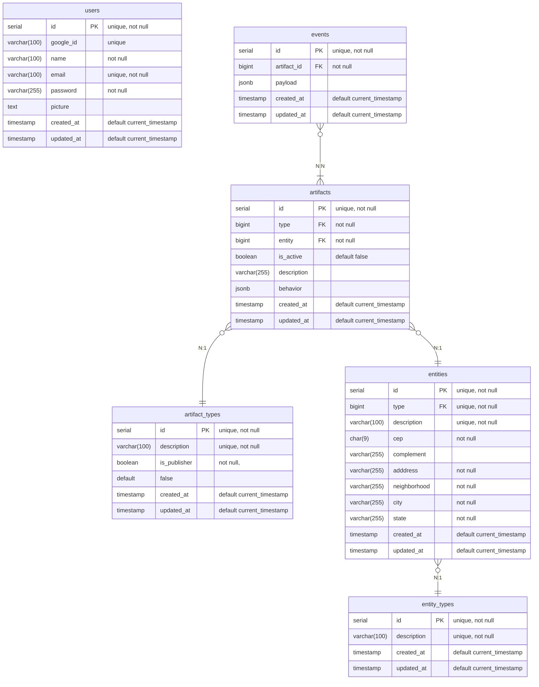

# Comunicação dos artefatos

```mermaid
flowchart LR
    art1(Artefato Publisher 1)
    art2(Artefato Publisher 2)
    art3(Artefato Publisher 3)
    mob1(Mobile 1)
    mob2(Mobile 2)
    mob3(Mobile 3)
    msg(Mensageria)
    api(API)
    bd[(Banco de dados)]

    art1 --> msg
    art2 --> msg
    art3 --> msg

    msg --> api <--> bd

    api <== websocket ==> mob1
    api <== websocket ==> mob2
    api <== websocket ==> mob3
```

# Comunicação dos beacons

```mermaid
flowchart LR
    b1(Beacon 1)
    b2(Beacon 2)
    b3(Beacon 3)
    mob1(Mobile 1)
    mob2(Mobile 2)
    mob3(Mobile 3)
    api(API)
    bd[(Banco de dados)]

    mob1 <== websocket ==> api
    mob2 <== websocket ==> api
    mob3 <== websocket ==> api
    api <--> bd

    b1 -..-> mob1
    b2 -..-> mob2
    b3 -..-> mob3
```

## Sequência de comunicação entre o beacon e o aplicativo

```mermaid
sequenceDiagram
    Usuario->>Aplicativo: Abre aplicativo

    activate Usuario
    activate Aplicativo

    loop 5 segundos
        Aplicativo->>Aplicativo: Busca por um novo beacon

        alt Beacon encontrado
            Aplicativo->>Aplicativo: Obtém os ids dos beacons 
            Aplicativo->>API: Obtém dados do beacon pelo id

            activate API

            API->>Banco de dados: Obtém dados do beacon e seu último evento

            activate Banco de dados

            Banco de dados-->>API: Dados do beacon e seu último evento

            deactivate Banco de dados

            API-->>Aplicativo: Dados do beacon e seu último evento

            deactivate API

            Aplicativo->>Usuario: Emite notificação sobre o beacon
        else Beacon não encontrado
            Aplicativo->>Aplicativo: Continua
        end

    end


    deactivate Usuario
    deactivate Aplicativo
```

# Banco de dados

```mermaid
erDiagram
    users {
        serial id PK "unique, not null"
        varchar(100) google_id "unique"
        varchar(100) name "not null"
        varchar(100) email "unique, not null"
        varchar(255) password "not null"
        text picture
        timestamp created_at "default current_timestamp"
        timestamp updated_at "default current_timestamp"
    }

    artifact_types {
        serial id PK "unique, not null"
        varchar(100) description "unique, not null"
        boolean is_publisher "not null, "default false""
        timestamp created_at "default current_timestamp"
        timestamp updated_at "default current_timestamp"
    }

    artifacts {
        serial id PK "unique, not null"
        bigint type FK "not null"
        bigint entity FK "not null"
        boolean is_active "default false"
        varchar(255) description
        jsonb behavior
        timestamp created_at "default current_timestamp"
        timestamp updated_at "default current_timestamp"
    }

    events {
        serial id PK "unique, not null"
        bigint artifact_id FK "not null"
        jsonb payload
        timestamp created_at "default current_timestamp"
        timestamp updated_at "default current_timestamp"
    }

    entity_types {
        serial id PK "unique, not null"
        varchar(100) description "unique, not null"
        timestamp created_at "default current_timestamp"
        timestamp updated_at "default current_timestamp"
    }

    entities {
        serial id PK "unique, not null"
        bigint type FK "unique, not null"
        varchar(100) description "unique, not null"
        char(9) cep "not null"
        varchar(255) complement
        varchar(255) adddress "not null"
        varchar(255) neighborhood "not null"
        varchar(255) city "not null"
        varchar(255) state "not null"
        timestamp created_at "default current_timestamp"
        timestamp updated_at "default current_timestamp"
    }

    artifacts }o--|| artifact_types : "N:1"
    entities }o--|| entity_types : "N:1"
    artifacts }o--|| entities : "N:1"
    events }o--|{ artifacts : "N:N"
```
