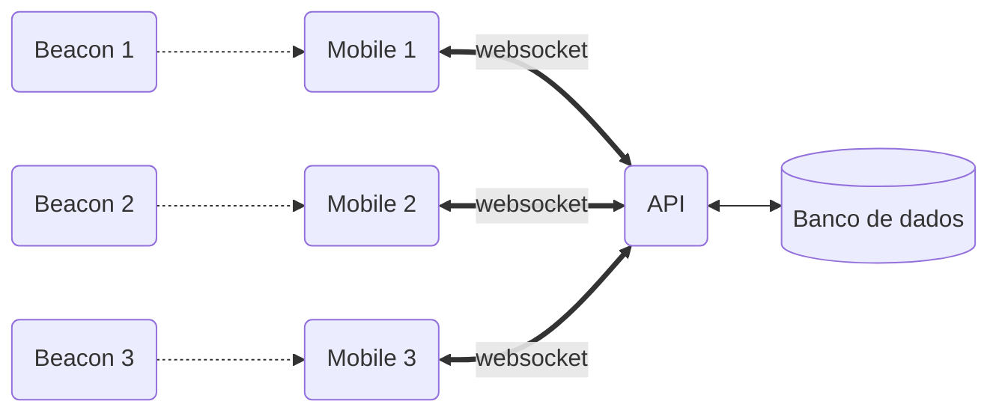

# Comunicação dos artefatos

```mermaid
flowchart LR
    art1(Artefato Publisher 1)
    art2(Artefato Publisher 2)
    art3(Artefato Publisher 3)
    mob1(Mobile 1)
    mob2(Mobile 2)
    mob3(Mobile 3)
    msg(Mensageria)
    api(API)
    bd[(Banco de dados)]

    art1 --> msg
    art2 --> msg
    art3 --> msg

    msg --> api <--> bd

    api <== websocket ==> mob1
    api <== websocket ==> mob2
    api <== websocket ==> mob3
```

# Comunicação dos beacons

```mermaid
flowchart LR
    b1(Beacon 1)
    b2(Beacon 2)
    b3(Beacon 3)
    mob1(Mobile 1)
    mob2(Mobile 2)
    mob3(Mobile 3)
    api(API)
    bd[(Banco de dados)]

    mob1 <== websocket ==> api
    mob2 <== websocket ==> api
    mob3 <== websocket ==> api
    api <--> bd

    b1 -..-> mob1
    b2 -..-> mob2
    b3 -..-> mob3
```
