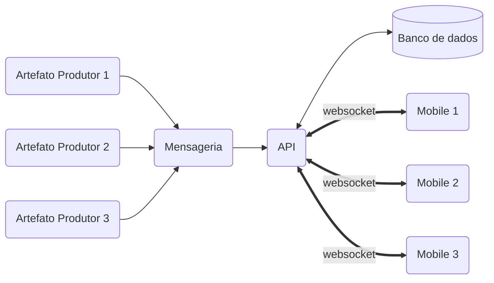
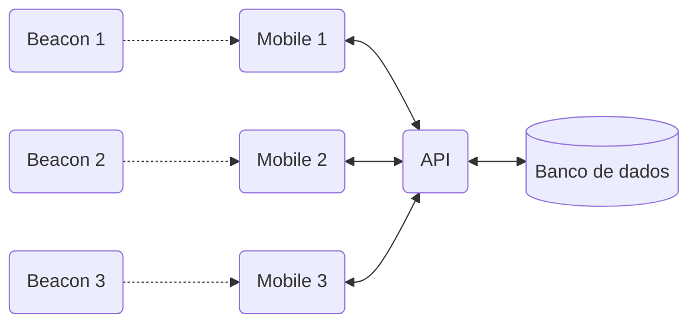
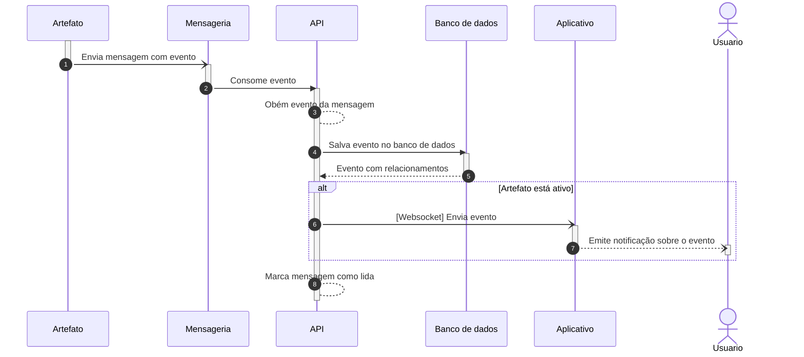
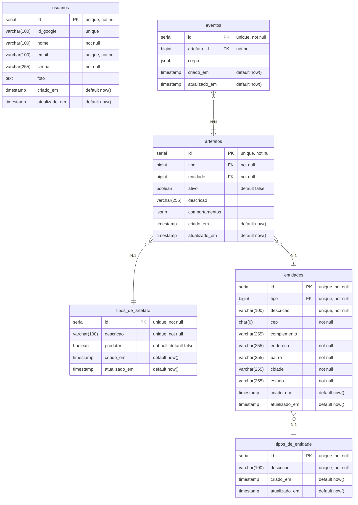

# Comunicação dos artefatos

```mermaid
flowchart LR
    art1(Artefato Produtor 1)
    art2(Artefato Produtor 2)
    art3(Artefato Produtor 3)
    mob1(Mobile 1)
    mob2(Mobile 2)
    mob3(Mobile 3)
    msg(Mensageria)
    api(API)
    bd[(Banco de dados)]

    art1 --> msg
    art2 --> msg
    art3 --> msg

    msg --> api <--> bd

    api <== websocket ==> mob1
    api <== websocket ==> mob2
    api <== websocket ==> mob3
```

# Comunicação dos beacons

```mermaid
flowchart LR
    b1(Beacon 1)
    b2(Beacon 2)
    b3(Beacon 3)
    mob1(Mobile 1)
    mob2(Mobile 2)
    mob3(Mobile 3)
    api(API)
    bd[(Banco de dados)]

    mob1 <--> api
    mob2 <--> api
    mob3 <--> api
    api <--> bd

    b1 -..-> mob1
    b2 -..-> mob2
    b3 -..-> mob3
```

## Descoberta de artefatos pelo aplicativo

```mermaid
sequenceDiagram
    autonumber

    actor Usuario
    participant Aplicativo
    participant API
    participant Banco de dados

    Usuario->>Aplicativo: Abre aplicativo

    activate Usuario
    activate Aplicativo

    loop 5 Segundos
        Aplicativo-->Aplicativo: Busca por um novo artefato

        alt Novo Artefato encontrado
            Aplicativo-->Aplicativo: Obtém id do Artefato
            Aplicativo->>API: Obtém dados do Artefato pelo id

            activate API

            API->>Banco de dados: Busca dados do Artefato e seu último evento

            activate Banco de dados

            Banco de dados-->>API: Dados do Artefato e seu último evento

            deactivate Banco de dados

            alt Dados encontrados
                alt Artefato está ativo
                    API-->>Aplicativo: [200] Dados do Artefato e seu último evento
                else Artefato não está ativo
                    API-->>Aplicativo: [204] Objeto vazio
                end
            else Dados não encontrados
                API-->>Aplicativo:[204] Objeto vazio
            end

            deactivate API

            Aplicativo--)Usuario: Emite notificação sobre o Artefato

            alt Artefato é um produtor e último evento não é nulo
                Aplicativo--)Usuario: Emite notificação sobre o último evento do Artefato
            else Artefato não é produtor mas possui comportamento
                Aplicativo--)Usuario: Emite notificação sobre o comportamento do Artefato
            end
        else Artefato não encontrado
            Aplicativo-->Aplicativo: Continua
        end

    end


    deactivate Usuario
    deactivate Aplicativo
```

## Envio de eventos pelos artefatos produtores

```mermaid
sequenceDiagram
    autonumber

    participant Artefato
    participant Mensageria
    participant API
    participant Banco de dados
    participant Aplicativo
    actor Usuario


    activate Artefato

    Artefato-)Mensageria: Envia mensagem com evento

    deactivate Artefato
    activate Mensageria

    Mensageria->>API: Consome evento

    deactivate Mensageria
    activate API

    API-->API: Obém evento da mensagem

    API->>Banco de dados: Salva evento no banco de dados

    activate Banco de dados

    Banco de dados-->>API: Evento com relacionamentos

    deactivate Banco de dados

    alt Artefato está ativo
        API-)Aplicativo: [Websocket] Envia evento

        activate Aplicativo

        Aplicativo--)Usuario: Emite notificação sobre o evento

        activate Usuario
        deactivate Usuario
        deactivate Aplicativo
    end

    API --> API: Marca mensagem como lida

    deactivate API

```

# Banco de dados

```mermaid
erDiagram
    usuarios {
        serial id PK "unique, not null"
        varchar(100) id_google "unique"
        varchar(100) nome "not null"
        varchar(100) email "unique, not null"
        varchar(255) senha "not null"
        text foto
        timestamp criado_em "default now()"
        timestamp atualizado_em "default now()"
    }

    tipos_de_artefato {
        serial id PK "unique, not null"
        varchar(100) descricao "unique, not null"
        boolean produtor "not null, default false"
        timestamp criado_em "default now()"
        timestamp atualizado_em "default now()"
    }

    artefatos {
        serial id PK "unique, not null"
        bigint tipo FK "not null"
        bigint entidade FK "not null"
        boolean ativo "default false"
        varchar(255) descricao
        jsonb comportamentos
        timestamp criado_em "default now()"
        timestamp atualizado_em "default now()"
    }

    eventos {
        serial id PK "unique, not null"
        bigint artefato_id FK "not null"
        jsonb corpo
        timestamp criado_em "default now()"
        timestamp atualizado_em "default now()"
    }

    tipos_de_entidade {
        serial id PK "unique, not null"
        varchar(100) descricao "unique, not null"
        timestamp criado_em "default now()"
        timestamp atualizado_em "default now()"
    }

    entidades {
        serial id PK "unique, not null"
        bigint tipo FK "unique, not null"
        varchar(100) descricao "unique, not null"
        char(9) cep "not null"
        varchar(255) complemento
        varchar(255) endereco "not null"
        varchar(255) bairro "not null"
        varchar(255) cidade "not null"
        varchar(255) estado "not null"
        timestamp criado_em "default now()"
        timestamp atualizado_em "default now()"
    }

    artefatos }o--|| tipos_de_artefato : "N:1"
    entidades }o--|| tipos_de_entidade : "N:1"
    artefatos }o--|| entidades : "N:1"
    eventos }o--|{ artefatos : "N:N"
```
