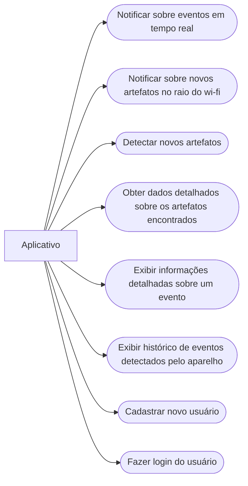
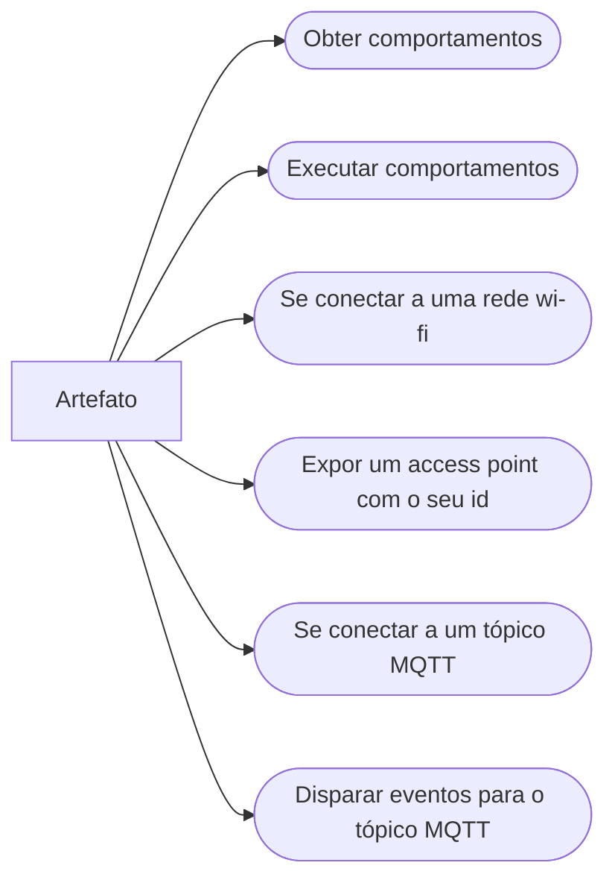
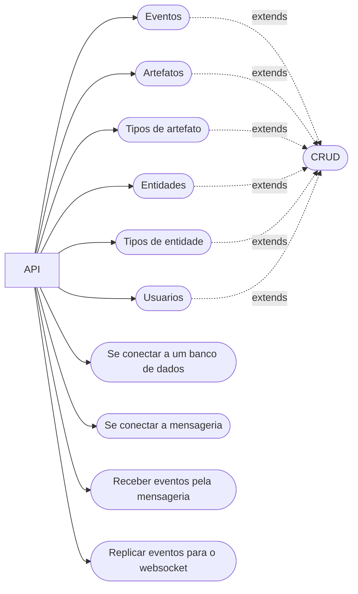

# Diagramas de caso de uso

## Casos de uso aplicativo

```mermaid
flowchart LR
    u[Aplicativo]

    u --> a([Notificar sobre eventos em tempo real])
    u --> b([Notificar sobre novos artefatos no raio do wi-fi])
    u --> c([Detectar novos artefatos])
    u --> d([Obter dados detalhados sobre os artefatos encontrados])
    u --> e([Exibir informações detalhadas sobre um evento])
    u --> f([Exibir histórico de eventos detectados pelo aparelho])
    u --> g([Cadastrar novo usuário])
    u --> h([Fazer login do usuário])
```

## Casos de uso artefatos

```mermaid
flowchart LR
    a[Artefato]

    a --> c([Obter comportamentos])
    a --> d([Executar comportamentos])
    a --> e([Se conectar a uma rede wi-fi])
    a --> f([Expor um access point com o seu id])
    a --> g([Se conectar a um tópico MQTT])
    a --> b([Disparar eventos para o tópico MQTT])
```

## Casos de uso api

```mermaid
flowchart LR
    a[API]
    crud([CRUD])

    a --> c([Eventos]) -. "extends" .-> crud
    a --> d([Artefatos]) -. "extends" .-> crud
    a --> e([Tipos de artefato]) -. "extends" .-> crud
    a --> f([Entidades]) -. "extends" .-> crud
    a --> g([Tipos de entidade]) -. "extends" .-> crud
    a --> l([Usuarios]) -. "extends" .-> crud
    a --> m([Se conectar a um banco de dados])
    a --> h([Se conectar a mensageria])
    a --> j([Receber eventos pela mensageria])
    a --> k([Replicar eventos para o websocket])
```
