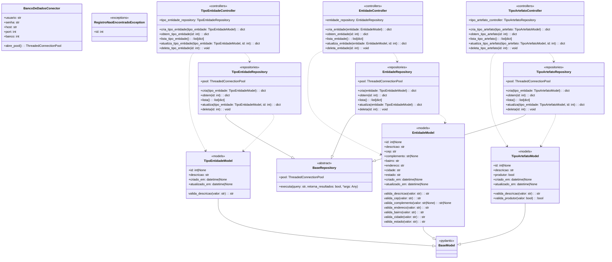

# Classes implementadas pelo projeto

```mermaid
classDiagram
    class BancoDeDadosConector {
        +usuario: str
        +senha: str
        +host: str
        +port: int
        +banco: int
        +abre_pool(): ThreadedConnectionPool
    }

    class BaseModel {
        <<pydantic>>
    }

    class BaseRepository {
        <<abstract>>
        <<repositories>>

        +pool: ThreadedConnectionPool

        +executa(query: str, retorna_resultados: bool, *args: Any)
    }

    class RegistroNaoEncontradoException {
        <<exceptions>>

        +id: int
    }

    class TipoEntidadeModel {
        <<models>>

        +id: int|None
        +descricao: str
        +criado_em: datetime|None
        +atualizado_em: datetime|None

        valida_descricao(valor: str): str
    }

    class EntidadeModel {
        <<models>>

        +id: int|None
        +descricao: str
        +cep: str
        +complemento: str|None
        +bairro: str
        +endereco: str
        +cidade: str
        +estado: str
        +criado_em: datetime|None
        +atualizado_em: datetime|None

        valida_descricao(valor: str): str
        valida_cep(valor: str): str
        valida_complemento(valor: str|None): str|None
        valida_endereco(valor: str): str
        valida_bairro(valor: str): str
        valida_cidade(valor: str): str
        valida_estado(valor: str): str
    }

    class TipoArtefatoModel {
        <<models>>

        +id: int|None
        +descricao: str
        +produtor: bool
        +criado_em: datetime|None
        +atualizado_em: datetime|None

        +valida_descricao(valor: str): str
        +valida_produtor(valor: bool): bool
    }

    class TipoEntidadeController {
        <<controllers>>

        +tipo_entidade_repository: TipoEntidadeRepository

        +cria_tipo_entidade(tipo_entidade: TipoEntidadeModel): dict
        +obtem_tipo_entidade(id: int): dict
        +lista_tipo_entidade(): list[dict]
        +atualiza_tipo_entidade(tipo_entidade: TipoEntidadeModel, id: int): dict
        +deleta_tipo_entidade(id: int): void
    }

    class EntidadeController {
        <<controllers>>

        +entidade_repository: EntidadeRepository

        +cria_entidade(entidade: EntidadeModel): dict
        +obtem_entidade(id: int): dict
        +lista_entidade(): list[dict]
        +atualiza_entidade(entidade: EntidadeModel, id: int): dict
        +deleta_entidade(id: int): void
    }

    class TipoArtefatoController {
        <<controllers>>

        +tipo_artefato_controller: TipoArtefatoRepository

        +cria_tipo_artefato(tipo_artefato: TipoArtefatoModel): dict
        +obtem_tipo_artefato(id: int): dict
        +lista_tipo_artefato(): list[dict]
        +atualiza_tipo_artefato(tipo_artefato: TipoArtefatoModel, id: int): dict
        +deleta_tipo_artefato(id: int): void
    }

    class TipoEntidadeRepository {
        <<repositories>>

        +pool: ThreadedConnectionPool

        +cria(tipo_entidade: TipoEntidadeModel): dict
        +obtem(id: int): dict
        +lista(): list[dict]
        +atualiza(tipo_entidade: TipoEntidadeModel, id: int): dict
        +deleta(id: int): void
    }

    class EntidadeRepository {
        <<repositories>>

        +pool: ThreadedConnectionPool

        +cria(entidade: TipoEntidadeModel): dict
        +obtem(id: int): dict
        +lista(): list[dict]
        +atualiza(entidade: TipoEntidadeModel): dict
        +deleta(id: int): void
    }

    class TipoArtefatoRepository {
        <<repositories>>

        +pool: ThreadedConnectionPool

        +cria(tipo_entidade: TipoArtefatoModel): dict
        +obtem(id: int): dict
        +lista(): list[dict]
        +atualiza(tipo_entidade: TipoArtefatoModel, id: int): dict
        +deleta(id: int): void
    }

    TipoEntidadeModel --|> BaseModel
    TipoEntidadeRepository --|> BaseRepository
    TipoEntidadeRepository ..> TipoEntidadeModel
    TipoEntidadeController ..> TipoEntidadeModel
    TipoEntidadeController ..> TipoEntidadeRepository

    EntidadeModel --|> BaseModel
    EntidadeRepository --|> BaseRepository
    EntidadeRepository ..> EntidadeModel
    EntidadeController ..> EntidadeModel
    EntidadeController ..> EntidadeRepository

    TipoArtefatoModel --|> BaseModel
    TipoArtefatoRepository --|> BaseRepository
    TipoArtefatoRepository ..> TipoArtefatoModel
    TipoArtefatoController ..> TipoArtefatoModel
    TipoArtefatoController ..> TipoArtefatoRepository
```
